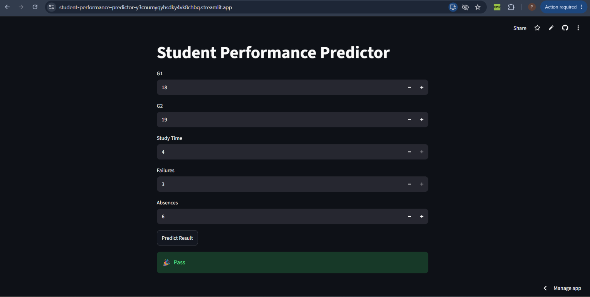

# Student Performance Predictor
A Machine Learning web application that predicts whether a student is likey to pass or be at risk based on their academic features.

## Dataset

This project uses the UCI Student Performance dataset.

## Demo

## features
- G1 (first period grade)
- G2 (second period grade)
- study time
- number of past failures
- absences

## Machine Learning Model
- Random Forest Classifier

## Model Performance

- Accuracy: 92.41%
- At Risk Precision: 86.2%
- At Risk Recall: 92.6%
- At Risk F1-score: 89.3%

## Technologies Used
- python
- pandas
- numpy
- scikit-learn
- streamlit
- joblib

## How to Run

1. Clone the repository.
2. Install the required libraries:
   `pip install -r requirements.txt`
3. Run the Streamlit application:
   `streamlit run app.py`

